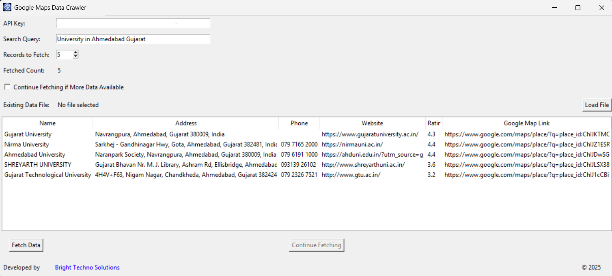

# Google Maps Data Crawler

A Python-based GUI tool to fetch and display business data from Google Maps using the Google Places API. This application allows you to:
- Input your API key at runtime.
- Enter a search query and select the number of records to fetch.
- View live data in a table (Name, Address, Phone, Website, Rating, and Google Map Link).
- Continue fetching additional data if available.
- Load an existing Excel/CSV file to avoid duplicate records.
- Append newly fetched data to the loaded file.



_Screenshot: Google Maps Data Crawler Application Interface_


## Features

- **Dynamic API Key Input:** Paste your Google Maps API key in the provided field.
- **Custom Query Input:** Search for any query to fetch business details.
- **Record Control:** Specify the number of records to fetch.
- **Duplicate Prevention:** Existing data is loaded from a file to avoid re-fetching duplicate records.
- **Live Data Display:** See fetched records updated in real-time.
- **Pagination Support:** Continue fetching more data using a “Continue Fetching” button if additional pages are available.

## Installation

1. **Clone the repository:**

   ```bash
   git clone https://github.com/vatsal-prajapati/google-maps-data-crawler.git
   cd google-maps-data-crawler
## Run As Executable

let’s generate an executable file and you are good to run this as a desktop app.

1. **Open the command prompt and navigate to the folder in which you have your python script**
2. **Execute the following code**

    ``` bash
    pyinstaller --onefile app.py


### Made with ❤️ by <a href="https://www.linkedin.com/in/vatsal-prajapati-671a541a4/">Vatsal Prajapati</a> | <a href="">Bright Techno Solutions</a>